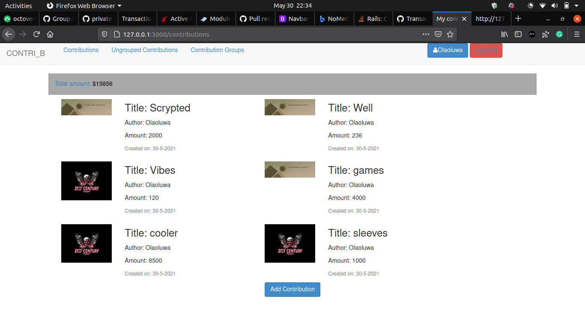

# Ruby on Rails Capstone Project: Contri_B

  - This is the capstone project of the Microverse Ruby on Rails curriculum.

  - In this project I created an contribution tracking app where users can create an account with their username and add contributions which can be grouped and ungrouped into the names of their choice.

  - Users can view contributions in each group.

  - Users can track the total amount of their contributions.


    Some of the advanced concepts explored in this project includes.

  - Basic Authentication using just username

  
  - Used RSpec as the test suite with the help of shoulda-matchers and capybara for effective testing. Unit, Functional and integration testing was done.

  

## Built With
  - Ruby,
  - Rails
  - HTML
  - CSS
  - Bootstrap
  - Rspec

## Live Demo

  - [Live Demo Link](https://contri-b.herokuapp.com/)

### Installation and Setup

  - Clone repo to your local machine with the following steps:

    ```git clone https://github.com/crappypapa/Contrib.git```

    ```cd Contrib```

  - Install gems with:

     ```bundle install```

  - Setup database with:

     ```rails db:create```
     ```rails db:migrate```

### Usage

  - Start a rails server in the terminal with:

    ```rails s```

  - Open ```http://localhost:3000``` in your browser.

### Run tests
  - Run in your terminal the code:

    ```rspec --format documentation```

## Author

  👤 **Olaoluwa Soladoye**

- Github: [@crappypapa](https://github.com/crappypapa)
- Twitter: [@_laoluwa](https://twitter.com/_laoluwa)
- Linkedin: [Olaoluwa](https://www.linkedin.com/in/olaoluwa-soladoye)

## 🤝 Contributing

  - Contributions, issues and feature requests are welcome!

  - Feel free to check the [issues page](https://github.com/crappypapa/Contrib/issues)

## Show your support

  - Give a ⭐️ if you like this project!

## Acknowledgments
  - Microverse
  - You can access all the design info (color, typography, layouts) in this link:

  - [Design](https://www.behance.net/gallery/19759151/Snapscan-iOs-design-and-branding?tracking_source=)

  - Design idea by [Gregoire Vella on Behance](https://www.behance.net/gregoirevella)